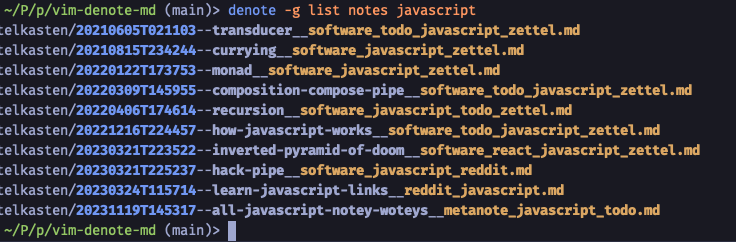

# denote-md

Shell script for Denote's Markdown + YAML variant.

Latest version: 1.0.0



---

Denote was written by Protesilaos Stavrou and is documented here:
- https://protesilaos.com/emacs/denote

This script, denote-md, implements Denote in its Markdown-with-YAML
front-matter variant only, with a couple of extra features that the author
finds personally useful. It was written by Conan Theobald.

There is a companion Vim plugin available.
- https://github.com/shuckster/denote-md
- https://github.com/shuckster/vim-denote-md

CLI usage:

```
Usage: denote-md.sh [-g] <command> [<args>]

  new                 [tags] [title]
  get      filename   [identifier]
  get      title      note.md
  replace  title      [new_title] *.md

  list     tags       [*.md]
  list     notes      [tags]
  list     recent     [num_notes]
  list     backlinks  note.md
  list     actions    [tags]

  add      tag        [tag] *.md
  remove   tag        [tag] *.md
  rename   tag        [tag] [new_name] *.md
  replace  tags       [new_tags] *.md

  refresh             *.md

  env                 Print environment variables
```

Commands that accept globs can also read files from `stdin`, eg:

```
ls *.md|denote-md list tags
```

Prefixing a command with `-g` will enable colour for any printed filenames.

Except for `new`, commands with missing arguments will print help and an
example for that command. The `new` command will prompt for missing arguments.

No command is confirmed before being executed, so please use in combination
with version control. You have been warned.

## Credits

Props to
[u/varsderk](https://www.reddit.com/r/vim/comments/17vm4i8/re_denote_for_vim_fineill_make_a_crappy_version/)
for introducing me to [denote](https://protesilaos.com/emacs/denote).

`denote-md` was written by [Conan Theobald](https://github.com/shuckster/).

I hope you found it useful! If so, I like [coffee ☕️](https://www.buymeacoffee.com/shuckster) :)
